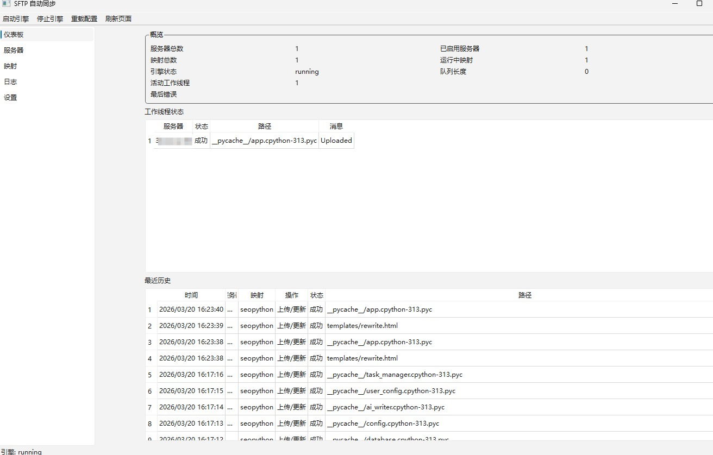
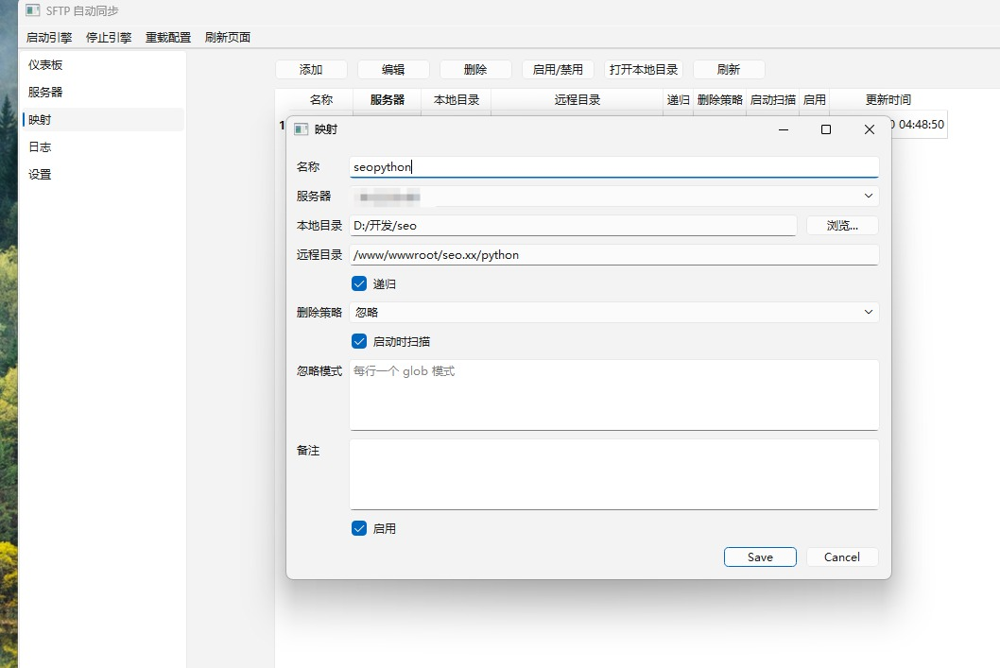
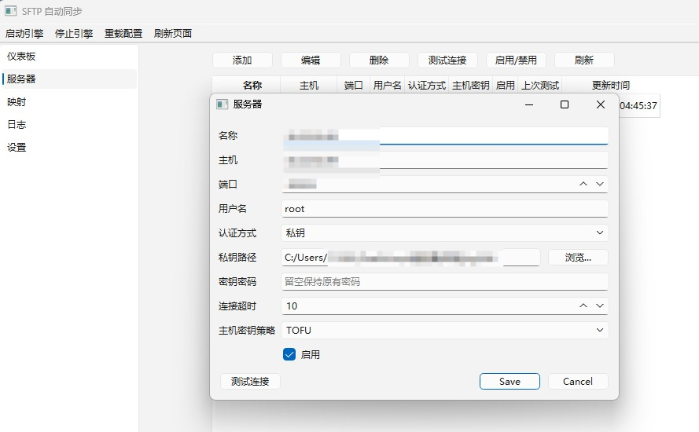

# SFTP Auto Sync

一款Windows桌面应用程序，用于监控多个本地目录，并通过SFTP自动将更改的文件上传到一个或多个Linux服务器。

## Screenshots





A Windows desktop application that watches multiple local directories and automatically uploads changed files to one or more Linux servers over SFTP.

## Features

- Multiple SFTP server profiles
- Multiple local directory -> remote directory mappings
- Password and private key authentication
- Custom port, timeout, host key policy (strict / TOFU)
- Keyring-based secret storage
- SQLite-based configuration persistence
- Watchdog-based file change monitoring
- Event debounce and dedupe
- Startup rescan to recover missed changes
- Per-server worker threads and retry queue
- PySide6 GUI for CRUD, testing connections, logs, and settings

## Project structure

```text
sftp_auto_sync/
  app/
  domain/
  infra/
  services/
  workers/
  ui/
```

## Quick start

```bash
python -m pip install -r requirements.txt
python -m sftp_auto_sync
```

## Packaging (Windows)

```bat
build_windows.bat
```

## Notes

- Secrets are stored in the system keyring, not in SQLite.
- The app stores runtime data under `%APPDATA%/SFTPAutoSync/` on Windows.
- Remote delete is disabled by default per mapping.
- Empty directories, symlinks, permissions, owner/group, and bidirectional sync are out of scope for V1.
