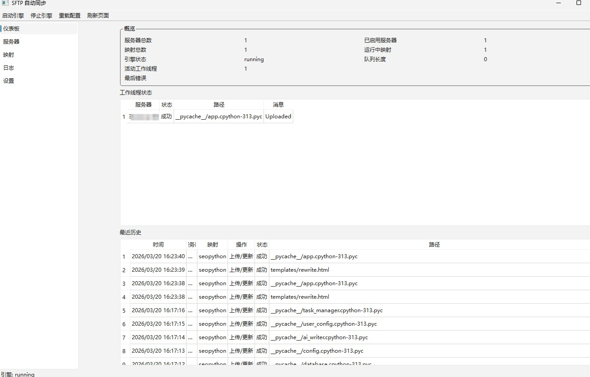
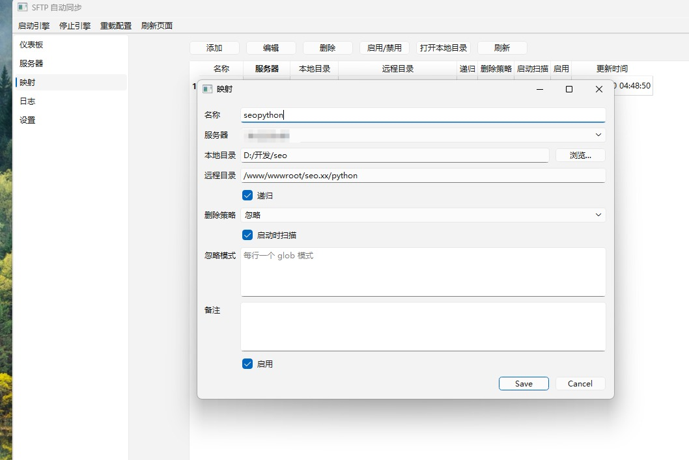
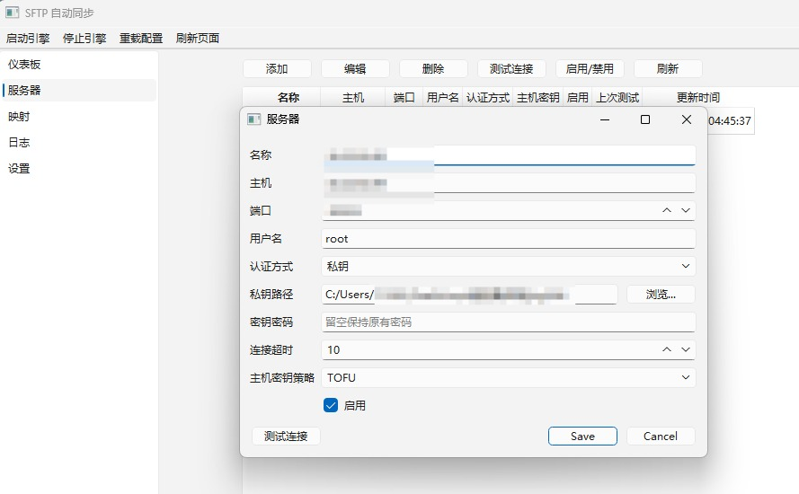

# SFTP Auto Sync

SFTP 文件同步工具，支持远程盘映射（SFTP 作为虚拟驱动器）。

## 安装依赖

```bash
pip install -r requirements.txt
```

## 运行

```bash
python -m sftp_auto_sync.app.main
```

或直接双击 `run.bat` / `run_hidden.vbs`

## 界面预览





## 主要功能

- SFTP 服务器管理
- 文件夹映射与同步
- 远程盘功能（SFTP 虚拟驱动器）
- 本地文件监控与自动上传
- PySide6 图形界面